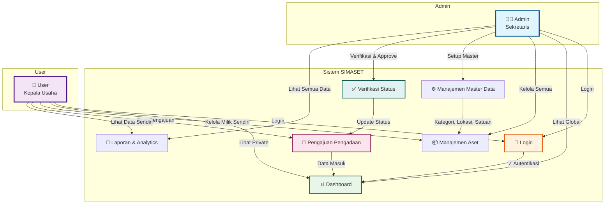
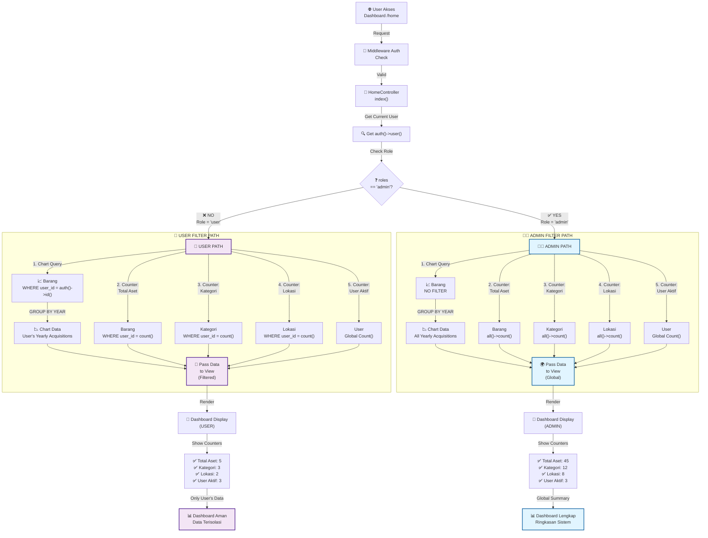
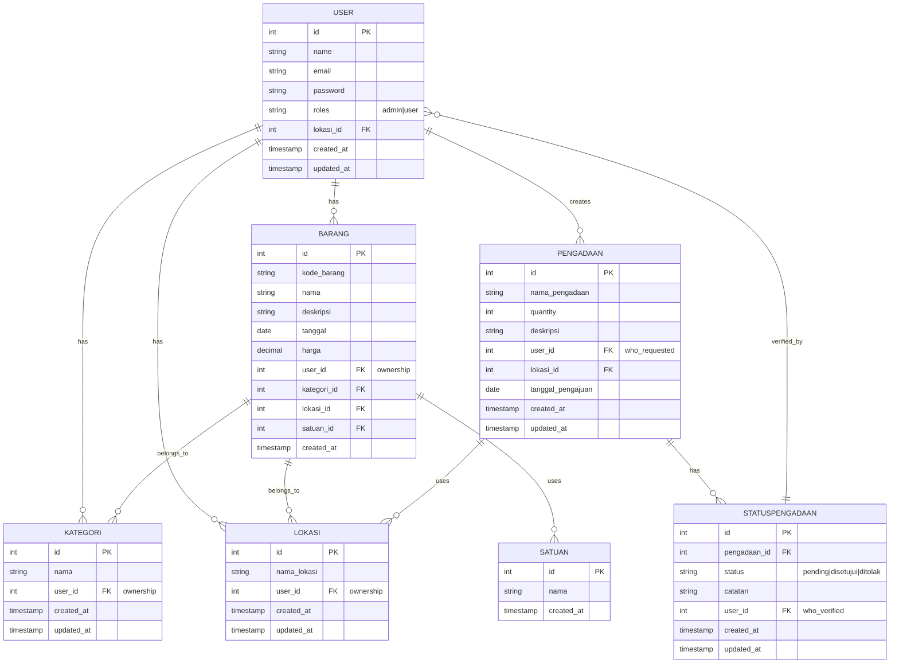
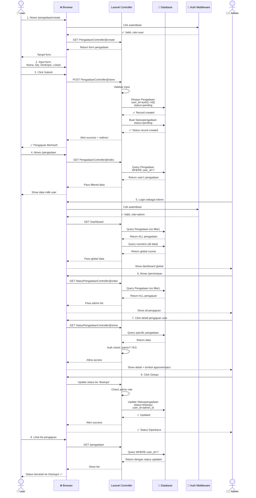

# 📐 DOKUMENTASI DIAGRAM - SIMASET (Sistem Informasi Manajemen Aset)

**Tanggal**: 18 Januari 2026  
**Status**: ✅ Complete  
**Versi**: 1.0

---

## 📋 Daftar Isi

1. [Usecase Diagram](#usecase-diagram)
2. [Activity Diagram: Pengajuan Pengadaan](#activity-diagram-pengajuan-pengadaan)
3. [Activity Diagram: Dashboard Filtering](#activity-diagram-dashboard-filtering)
4. [Class Diagram: Data Model](#class-diagram-data-model)
5. [Sequence Diagram: Alur Sistem](#sequence-diagram-alur-sistem)

---

## 🎭 Usecase Diagram

### Deskripsi
Diagram ini menunjukkan interaksi antara dua role utama (Admin dan User) dengan fitur-fitur utama sistem SIMASET.



### Penjelasan Fitur Utama

| Fitur | Admin | User | Deskripsi |
|-------|-------|------|-----------|
| **Login** | ✅ | ✅ | Autentikasi sistem |
| **Dashboard** | 🌍 Global | 👤 Private | Admin lihat semua data, User lihat milik sendiri |
| **Manajemen Aset** | Semua | Milik Sendiri | Kelola data barang/aset |
| **Master Data** | Setup ✅ | Readonly | Kategori, Lokasi, Satuan |
| **Pengajuan Pengadaan** | Verifikasi | Buat | User membuat, Admin verifikasi |
| **Status Pengadaan** | Ubah Status | Lihat | Admin ubah ke Disetujui/Ditolak |
| **Laporan** | Semua Data | Data Sendiri | Analytics & reporting |

---

## 🔄 Activity Diagram: Pengajuan Pengadaan

### Alur Proses Pengajuan Barang dari User hingga Approval Admin

```mermaid
graph TD
    A["👤 User Membuka Form<br/>Pengajuan Pengadaan"] -->|Akses /pengadaan/create| B["📋 Form Pengajuan<br/>Ditampilkan"]
    
    B -->|Input:<br/>- Nama Pengadaan<br/>- Quantity<br/>- Deskripsi<br/>- Lokasi| C["✏️ User Mengisi<br/>Form Data"]
    
    C -->|Click Submit| D{"📊 Validasi<br/>Data"}
    
    D -->|❌ Ada Error| E["⚠️ Tampil Error<br/>Message"]
    E -->|User Perbaiki| C
    
    D -->|✅ Valid| F["💾 Simpan ke Database<br/>Pengadaan Table"]
    
    F -->|Auto Set:<br/>- user_id = auth()->id()<br/>- status = 'pending'<br/>- tanggal_pengajuan = now()| G["📥 Data Masuk<br/>dengan Status PENDING"]
    
    G -->|Buat Record| H["📌 Buat Status History<br/>Statuspengadaan Table"]
    
    H -->|Status = pending| I["✅ Success Alert<br/>Redirect ke List"]
    
    I -->|Akses /pengadaan| J["📋 List Pengajuan<br/>User"]
    
    J -->|Filter:<br/>WHERE user_id = auth()->id()| K["👤 User Lihat Data<br/>Milik Sendiri Saja"]
    
    K -->|Admin Login| L["👨‍💼 Admin Dashboard"]
    
    L -->|Akses /permintaan| M["📋 List Permintaan<br/>Admin (Global)"]
    
    M -->|JOIN dengan<br/>statuspengadaans| N["🌍 Admin Lihat<br/>SEMUA Pengajuan"]
    
    N -->|Klik Detail/<br/>Edit Status| O["🔍 Admin Review<br/>Data Pengajuan"]
    
    O -->|Tombol Approve| P{"❓ Admin<br/>Putuskan"}
    
    P -->|Setujui| Q["✅ Update Status<br/>ke 'Disetujui'"]
    P -->|Tolak| R["❌ Update Status<br/>ke 'Ditolak'"]
    P -->|Edit| S["✏️ Tambah Catatan<br/>di Field catatan"]
    
    Q -->|Update| T["📊 Status History<br/>Terupdate"]
    R -->|Update| T
    S -->|Save| T
    
    T -->|Success Alert| U["🔔 Notification<br/>Sistem"]
    
    U -->|User Lihat List| V["👤 User Lihat Status<br/>Pengajuannya Berubah"]
    
    style A fill:#f3e5f5,stroke:#4a148c,stroke-width:2px
    style G fill:#fff3e0,stroke:#e65100,stroke-width:2px
    style L fill:#e1f5ff,stroke:#01579b,stroke-width:2px
    style N fill:#e1f5ff,stroke:#01579b,stroke-width:2px
    style Q fill:#e8f5e9,stroke:#1b5e20,stroke-width:2px
    style R fill:#ffebee,stroke:#b71c1c,stroke-width:2px
```

### Penjelasan Alur

| Tahap | Deskripsi | Kode Terkait |
|-------|-----------|--------------|
| **User Input** | User mengisi form pengajuan | `PengadaanController::create()` |
| **Validasi** | Laravel validate rules diterapkan | `$request->validate()` |
| **Simpan Data** | Set user_id, status, tanggal otomatis | `Pengadaan::create($validated)` |
| **Status Pending** | Record awal dengan status = 'pending' | `Statuspengadaan::create()` |
| **User List** | User hanya lihat data sendiri | `WHERE user_id = auth()->id()` |
| **Admin List** | Admin lihat semua (global view) | `JOIN statuspengadaans` (no filter) |
| **Admin Review** | Admin bisa lihat, edit, approve/reject | `Authorization check` |
| **Status Update** | Ubah ke Disetujui/Ditolak + catatan | `Statuspengadaan::update()` |
| **User Notifikasi** | User lihat status berubah | Dashboard refresh |

---

## 📊 Activity Diagram: Dashboard Filtering

### Bagaimana Dashboard Menampilkan Data Berbeda untuk User vs Admin



### Penjelasan Data Flow

#### User View (Filtered)
```
Dashboard User
├─ Total Aset:   5  (hanya milik user)
├─ Kategori:     3  (hanya milik user)
├─ Lokasi:       2  (hanya milik user)
├─ User Aktif:   3  (global, sistem info)
└─ Chart: Trend aktual pengadaan user per tahun
```

#### Admin View (Global)
```
Dashboard Admin
├─ Total Aset:   45 (semua user digabung)
├─ Kategori:     12 (semua user digabung)
├─ Lokasi:       8  (semua user digabung)
├─ User Aktif:   3  (global, sistem info)
└─ Chart: Trend pengadaan semua user per tahun
```

---

## 📦 Class Diagram: Data Model

### Relasi Entitas dan Atribut Utama



### Penjelasan Relasi

| Relasi | Deskripsi |
|--------|-----------|
| **USER → BARANG** | User memiliki multiple barang (1:N) |
| **USER → KATEGORI** | User membuat kategori sendiri (1:N) |
| **USER → LOKASI** | User memiliki lokasi sendiri (1:N) |
| **USER → PENGADAAN** | User mengajukan pengadaan (1:N) |
| **PENGADAAN → STATUSPENGADAAN** | Pengadaan bisa punya multiple status history (1:N) |
| **BARANG → KATEGORI** | Barang milik kategori tertentu (N:1) |
| **BARANG → LOKASI** | Barang ada di lokasi tertentu (N:1) |

### Tabel User_id untuk Privacy Control

```
Tabel yang menggunakan user_id untuk filtering:
✅ BARANG.user_id           → Filter barang milik user
✅ KATEGORI.user_id         → Filter kategori milik user
✅ LOKASI.user_id           → Filter lokasi milik user
✅ PENGADAAN.user_id        → Filter pengajuan milik user
✅ STATUSPENGADAAN.user_id  → Track siapa yang verify
```

---

## 🔄 Sequence Diagram: Alur Sistem Lengkap

### Skenario: User Mengajukan Pengadaan hingga Admin Approve



---

## 📝 Catatan Implementasi

### Privacy Control Implementation

```
Lokasi File Logika:
├─ app/Http/Controllers/HomeController.php
│  └─ Dashboard filtering by user_id
│
├─ app/Http/Controllers/PengadaanController.php
│  ├─ index() → Filter WHERE user_id
│  ├─ show() → Authorization check
│  ├─ edit() → Authorization check
│  └─ update() → Authorization check
│
├─ app/Http/Controllers/StatusPengadaanController.php
│  ├─ index() → Filter WHERE user_id
│  └─ show() → Authorization check
│
├─ app/Models/Barang.php
│  └─ user_id field untuk ownership
│
├─ app/Models/Kategori.php
│  └─ user_id field untuk ownership
│
├─ app/Models/Lokasi.php
│  └─ user_id field untuk ownership
│
└─ app/Models/Pengadaan.php
   └─ user_id field untuk ownership
```

### Database Schema Key Fields

```sql
-- Ownership Tracking
ALTER TABLE barangs ADD user_id UNSIGNED INTEGER;
ALTER TABLE kategoris ADD user_id UNSIGNED INTEGER;
ALTER TABLE lokasis ADD user_id UNSIGNED INTEGER;
ALTER TABLE pengadaans ADD user_id UNSIGNED INTEGER;
ALTER TABLE statuspengadaans ADD user_id UNSIGNED INTEGER;

-- Foreign Keys
ALTER TABLE barangs ADD FOREIGN KEY (user_id) REFERENCES users(id);
ALTER TABLE kategoris ADD FOREIGN KEY (user_id) REFERENCES users(id);
ALTER TABLE lokasis ADD FOREIGN KEY (user_id) REFERENCES users(id);
ALTER TABLE pengadaans ADD FOREIGN KEY (user_id) REFERENCES users(id);
ALTER TABLE statuspengadaans ADD FOREIGN KEY (user_id) REFERENCES users(id);
```

### Query Filtering Patterns

```php
// USER: Filter by user_id
WHERE user_id = auth()->user()->id

// ADMIN: No filter (show all)
// Default: Barang::all() or empty WHERE clause
```

---

## 🎓 Kesimpulan

Diagram-diagram di atas menunjukkan:

1. **Usecase Diagram** → Interaksi user dan admin dengan sistem
2. **Activity Diagram Pengajuan** → Alur lengkap dari user request hingga admin approve
3. **Activity Diagram Dashboard** → Bagaimana filtering privacy diterapkan
4. **Class Diagram** → Relasi entitas dan field user_id untuk privacy
5. **Sequence Diagram** → Timeline interaksi user-admin-database

Semua diagram ini mencerminkan logika yang sudah diimplementasikan di:
- `HomeController.php` → Dashboard filtering
- `PengadaanController.php` → Pengajuan & privacy
- `StatusPengadaanController.php` → Verifikasi & privacy

**Status**: ✅ Dokumentasi sesuai dengan kode aktual sistem

---

**Created**: 18 Januari 2026  
**Version**: 1.0  
**Format**: Mermaid.js (GitHub-compatible)

